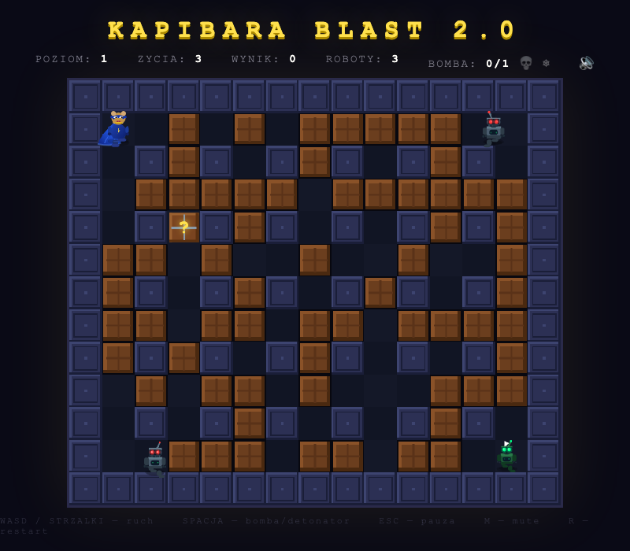

# KAPIBARA BLAST 2.0

A Bomberman-style arcade browser game where you play as a capybara superhero fighting robots on a grid-based arena.

Built as a single HTML file with vanilla JavaScript and Canvas 2D — zero external dependencies. All graphics are rendered programmatically and all audio is generated procedurally via Web Audio API.



## Play

Open `index.html` in a browser.

## Controls

| Action         | Key               |
|----------------|-------------------|
| Move           | WASD / Arrow keys |
| Bomb           | Space             |
| Pause          | ESC / P           |
| Restart        | R                 |
| Mute           | M                 |
| Skins          | S                 |
| Quiz answers   | 1-4               |

Touch controls are available on mobile.

## Features

- 15x13 grid arena with destructible crates and indestructible walls
- 6 robot types: Basic, Chaser, Speeder, Tank, Splitter, Boss
- Bomb system with cross-shaped explosions and configurable blast radius
- Power-ups: range, speed, extra life, extra bombs, shield, ghost, detonator, mega bomb
- Map elements: teleports, spikes
- Mystery Box with Polish-to-English vocabulary quiz (10 questions per quiz)
- Tiered quiz rewards: random powerup, remote bomb, extra lives, mega bomb, freeze bomb, skin unlock
- Freeze bomb mechanic — freezes all robots for 20 seconds
- 7 capybara skins (default + 6 unlockable), selectable from menu or pause screen
- Multi-level progression with increasing difficulty and boss fights every 5 levels
- Combo scoring system and time bonuses
- Particle effects, screen shake, and procedural audio
- Start screen, pause menu, level summary, and skin selection screens
- High score tracking and game save via localStorage
- Dark pixel-art aesthetic rendered entirely in code

## Tech

- **Single file** — everything lives in `index.html`
- **No dependencies** — no CDN, no npm runtime deps, no asset files
- **60 FPS** target with delta-time physics and particle pooling
- **Browser support** — Chrome, Firefox, Safari, Edge

## Development

```bash
npm install        # install dev dependencies (Playwright)
npx playwright test # run tests
```
